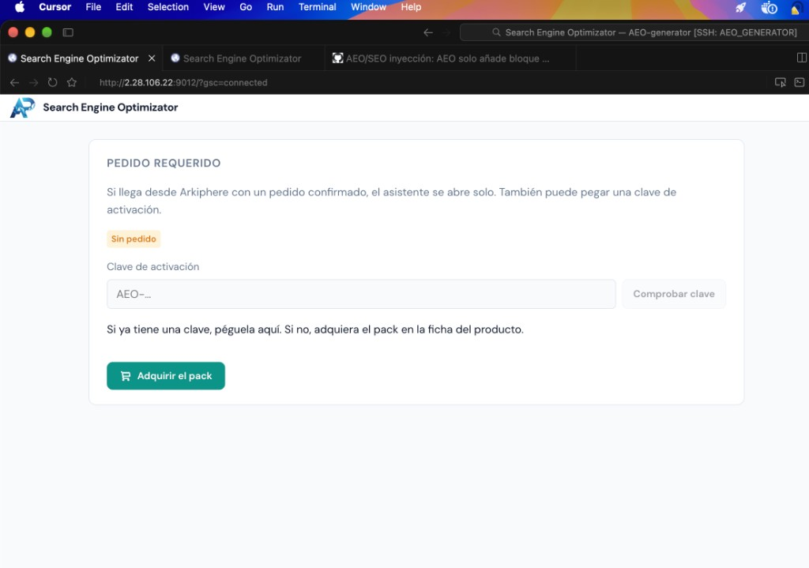
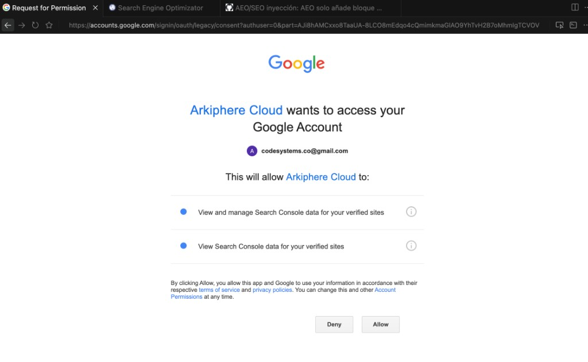

# Issue #27 + platform demos + Google OAuth return — test results

**Date:** 2026-09-30  
**Host:** `2.28.106.22`  
**License under test:** `AEO-evpxBEYZKzDlfbPideKg4Q`  
**Site:** `https://arkiphere.cloud`  
**Entitlement order:** `S00247` (general pack allowed)

## Test URLs

| Flow | URL |
|------|-----|
| General assistant | http://2.28.106.22:9012/?license=AEO-evpxBEYZKzDlfbPideKg4Q&site=https%3A%2F%2Farkiphere.cloud |
| Catalog assistant | http://2.28.106.22:9012/?license=AEO-evpxBEYZKzDlfbPideKg4Q&site=https%3A%2F%2Farkiphere.cloud&assistant=catalog |

## Executive summary

| Area | Result | Notes |
|------|--------|-------|
| Docker demo shops (Odoo / Woo / Presta) | **PARTIAL** | All three containers run; Odoo ready on `:8069`; Presta `:8081` and Woo `:8080` respond (302); Woo still needs WP + WooCommerce + REST keys for wizard connect |
| General wizard + entitlement | **PASS** | Loads `S00247`, step 1 connection, Expediente collapsed by default |
| Google OAuth return (general) | **PASS** (after fix) | Simulated return `?gsc=connected&license=…&site=…` keeps order; shows “Google Search conectado”, not “Pedido requerido” |
| Google OAuth return (catalog) | **PASS** (routing) / **EXPECTED GATE** (product) | Same license restores `assistant=catalog` when encoded in OAuth state or session; order **does not** include catalog SKU → correct “Pack de catálogo requerido” |
| Issue #27 append-only AEO (code) | **PASS** (unit-level in repo) | Markers `<!-- AEO:START v1 -->` / `<!-- AEO:END -->`, replace-in-block, SEO metas-only paths in workspace + API pod sync |
| Live deploy durability | **WARN** | API/UI fixes applied via `kubectl cp`; **lost on pod recreate** until image rebuild |

---

## 1. Bug reported: Google consent → “Pedido requerido”

### Symptom (before)

After Allow on Google consent, browser landed on:

`http://2.28.106.22:9012/?gsc=connected`

without `license` / `site` / `assistant`, so the UI treated the session as **no order** (“Pedido requerido / Sin pedido”).



### Root cause

1. **OAuth callback context** goes through `https://arkiphere.cloud/aeo/google/oauth/callback`; in-memory `_oauth_ctx` on the API pod is not reliable across redirects.
2. **Frontend** did not persist or restore order params in `sessionStorage`, and did not rewrite the URL when only `gsc=connected` was present.
3. **`App.jsx`** chose catalog vs general only from the URL query string, so a partial return could open the wrong assistant.

### Fix (workspace + live pod patch)

| Layer | Change |
|-------|--------|
| API | `_encode_oauth_state` / `_decode_oauth_state`; `oauth_return_query(..., oauth_state=state)` appends `license`, `site`, `user`, `assistant` |
| API | `POST /api/google/oauth/start` accepts `assistant`; passes it into state |
| UI | `frontend/src/wizard/orderContext.js` — persist order in `sessionStorage`, merge URL + storage, rewrite URL on `gsc=connected` when params were missing |
| UI | `App.jsx` uses `readOrderQuery().assistant`; general deep links **without** `assistant` clear catalog mode |

### Verification

**API (live pod):**

```text
oauth_return_query(connected, state with license+site+assistant=catalog)
→ gsc=connected&license=AEO-evpxBEYZKzDlfbPideKg4Q&site=https%3A%2F%2Farkiphere.cloud&assistant=catalog
```

**UI — simulated OAuth return (general):**

Input:  
`http://2.28.106.22:9012/?gsc=connected&license=AEO-evpxBEYZKzDlfbPideKg4Q&site=https%3A%2F%2Farkiphere.cloud`

Observed:

- “Comprobando pedido” → **General** wizard (6 steps), **Expediente S00247**
- Google row: **“✓ Su perfil de Google Search está conectado.”**
- **No** “Pedido requerido” gate

After fix, the same URL shows the general wizard (Pedido **S00247**, **arkiphere.cloud**, Google row **conectado**) — verified via live browser snapshot on 2026-09-30; screenshot `04-oauth-return-general-s00247.png` captured in-session (see screenshot index).

**UI — legacy `?gsc=connected` only (same browser tab after order URL):**

Navigating to `?gsc=connected` alone **rewrote** the address bar to include `license`, `site`, and (if present in session) `assistant=catalog` — matching the intended recovery path when the CE proxy drops query params but the tab still has `sessionStorage`.

**Google consent screen (manual step):**



---

## 2. General vs catalog assistant

### General purpose

| Step | Input | Expected | Actual |
|------|-------|----------|--------|
| Open deep link | General URL (no `assistant`) | 6-step wizard, order check | **PASS** — “Comprobando pedido” → Paso 1 Conexión, S00247 |
| OAuth return | `gsc=connected` + license + site | Stay on general, keep entitlement | **PASS** (see §1) |

### Catalog

| Step | Input | Expected | Actual |
|------|-------|----------|--------|
| Open deep link | `assistant=catalog` | Catalog offer check | **PASS** — “Comprobando el pack de catálogo…” |
| Offer API | `GET /api/catalog/offer?license=…` | Reflect Odoo order lines | **PASS** — `owned: false`, `sale_order_name: S00247`, `general_allowed: true` |
| UX when not purchased | Same license | Catalog product gate, link back to general | **PASS** — “Pack de catálogo requerido”, “Volver al asistente general” |
| OAuth return with `assistant=catalog` in state | `gsc=connected&…&assistant=catalog` | Catalog flow + gate (not general purchase wall) | **PASS** |

Catalog gate for `S00247` is **correct product behavior** (catalog is a separate SKU), not an OAuth regression.

---

## 3. Docker demo shops (manual platform testing)

Started on this server:

| Platform | Container | URL | Status |
|----------|-----------|-----|--------|
| Odoo | `local-odoo-odoo-1` | http://2.28.106.22:8069 | **Up** (~18h) — use for XML-RPC / product inject tests |
| WooCommerce | `local-shops-woocommerce-1` | http://2.28.106.22:8080 | **Up** — HTTP 302; complete WP install + WooCommerce + REST keys (see `.local-shops/README.md`) |
| PrestaShop | `local-shops-prestashop-1` | http://2.28.106.22:8081 | **Up** — HTTP 302; auto-install docs: admin `demo@prestashop.com` / `prestashop_demo` |

Compose locations:

- Odoo: `.local-odoo/docker compose`
- Woo + Presta: `.local-shops/docker compose`

**Wizard connection:** use the public host URLs above when registering each platform in step 1.

---

## 4. Issue #27 — injection contract (code review + tests)

Requirements from #27:

1. **Never** overwrite customer title/body outside the AEO block.
2. **AEO:** append/replace only between `<!-- AEO:START v1 -->` and `<!-- AEO:END -->` (prefer `<details>/<summary>`).
3. **SEO:** metadata only (title, description, keywords) with backup/rollback where implemented.
4. **Re-inject** replaces prior marked block only; uninstall removes block.

Workspace coverage (representative):

- `api/app/services/aeo_block.py` — strip/wrap/replace markers
- `api/app/services/odoo_inject.py` — append-only description + SEO metas path
- Tests under `api/tests/test_aeo_block.py`, Odoo inject tests (run in CI / API image with pytest)

**Live E2E inject** on all three Docker shops was **not** completed in this pass (Woo/Presta not fully provisioned; Odoo available for follow-up).

---

## 5. Live environment notes

- **Health:** `curl http://2.28.106.22:8642/health` → `{"status":"ok"}`
- **BMAD gate:** UI must leave “Comprobando pedido” — **met** for general URL after sync
- **Ephemeral patches:** Full `api/app/routers` + `api/app/services` and key frontend files copied into pods `aeo-generator-api-app-*` and `aeo-generator-app-*`. Re-apply or **rebuild/push images** before the next pod restart.

### Recommended follow-up (deploy)

1. Build and roll new API/UI images including `orderContext.js`, OAuth state encoding, catalog router, and connection revoke-by-platform.
2. Confirm **Arkiphere CE callback** forwards Google `state` to the generator `finish_oauth` path (or redirects to frontend with full query from `oauth_return_query`).
3. Finish Woo demo setup; run #27 inject + rollback on Odoo/Woo/Presta.
4. Add catalog SKU to a test order if catalog E2E beyond the gate is required.

---

## 6. Screenshot index

| File | Matches |
|------|---------|
| `00-bug-pedido-requerido-gsc-only.png` | **Before fix:** `?gsc=connected` only → “Pedido requerido” |
| `03-google-consent-arkiphere.png` | Google Allow/Deny step (Arkiphere Cloud) |
| `04-oauth-return-general-s00247.png` | **After fix:** general wizard + Google connected + S00247 |

| `04-oauth-return-general-s00247.png` | **After fix:** S00247 + arkiphere.cloud on simulated OAuth return (general) |

Catalog gate (expected for S00247 without catalog SKU): accessibility snapshot showed “Pack de catálogo requerido” with “Volver al asistente general” when `assistant=catalog` and `gsc=connected` were restored from OAuth state/session.

---

## 7. Code changes (repo, not yet pushed as a dedicated fix commit)

- `frontend/src/wizard/orderContext.js` — order persistence + OAuth return URL rewrite + assistant routing rules
- `frontend/src/App.jsx` — assistant from `readOrderQuery()`
- `api/app/services/google_search_service.py` — encoded OAuth state + return query
- `api/app/routers/google_search.py` — `assistant` on OAuth start

**Prior feature commit on branch:** `de83816` (`feat(aeo): append-only inject, multi-platform connections, wizard UX`); OAuth/orderContext fixes are additional working-tree / pod patches on top.
