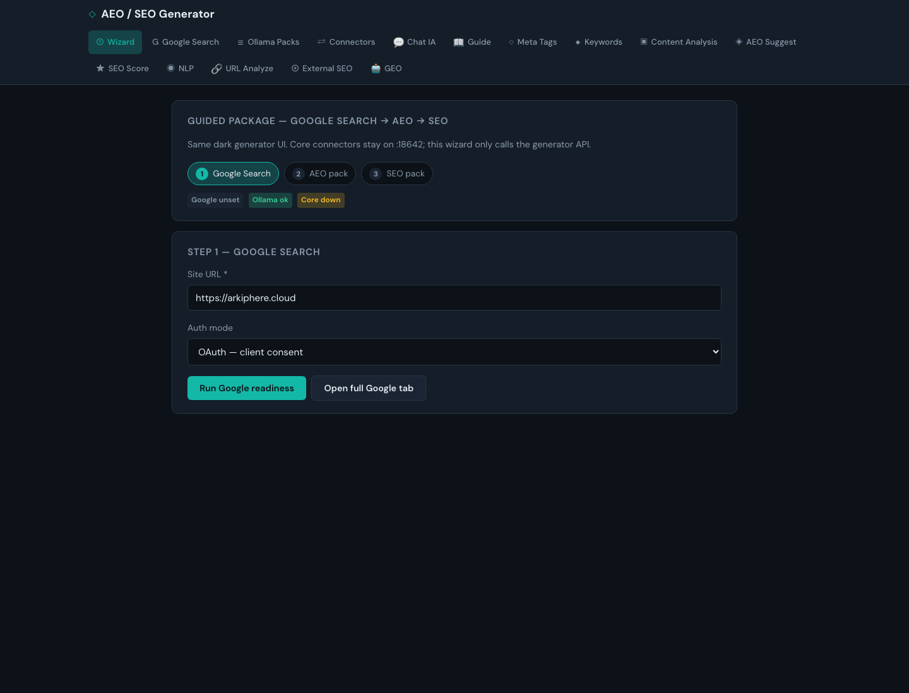
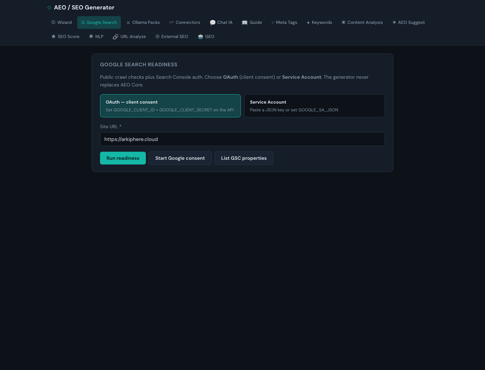
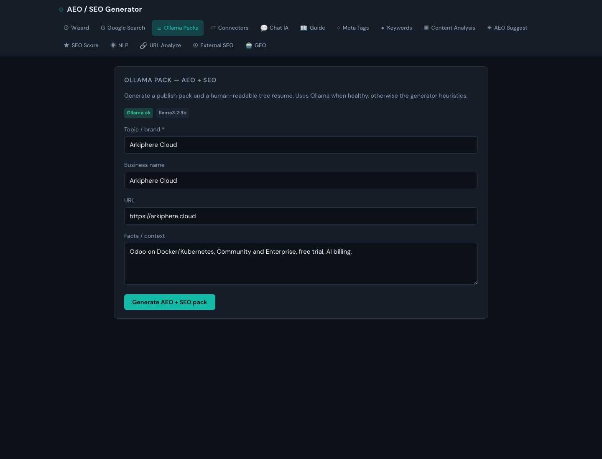

# AEO Generator — full flow tested (live product UI)

**Date:** 2026-09-15 (Europe/Madrid)  
**Verdict:** **PASS**  
**Product UI:** http://2.28.106.22:9012/  
**API docs:** http://2.28.106.22:8642/docs  
**Rule:** BMAD `SCREENSHOT_STEP_VERIFICATION`  
**Evidence:** `qa/evidence/2026-09-15_aeo_generator_full_flow/` (`RESULTS.md`, `SCREEN_REVIEW.md`, `screenshots/`)  
**BMAD copy:** `_bmad-output/evidence/2026-09-15_aeo_generator_full_flow/`

This is the **default React/Vite aeo-generator UI** (dark product surface), not Core light HTML under `/ui/packages`.

---

## Flow overview

| Step | Surface | Result |
|------|---------|--------|
| 0 | Home / default Wizard | PASS |
| 1 | Wizard — Run Google readiness | PASS |
| 2 | Google Search — readiness on https://arkiphere.cloud | PASS |
| 3 | Ollama Packs — generate + tree list resume | PASS |
| 4 | Wizard guided progress | PASS |
| 5 | Connectors — Core offline (expected) + write attempt | PASS (env) |
| 6 | Meta Tags regression generate | PASS |
| — | Deep links `#wizard` `#google` `#packs` `#connectors` `#meta` | PASS |

---

## Step 0 — Open live UI

http://2.28.106.22:9012/ — title **AEO / SEO Generator**.

---

## Step 1 — Wizard (Google → AEO → SEO)

Deep link: http://2.28.106.22:9012/#wizard  

Status chips: Google unset / Ollama ok / Core down.

Run Google readiness on `https://arkiphere.cloud` from the wizard:

---

## Step 2 — Google Search readiness

Deep link: http://2.28.106.22:9012/#google  

OAuth vs Service Account mode cards. OAuth secrets **unset** in this environment (expected). Public crawl checks still run.

After **Run readiness**:

---

## Step 3 — Ollama Packs (tree list resume)

Deep link: http://2.28.106.22:9012/#packs  

After generate finishes, **TREE LIST RESUME** is visible (FAQ / title / summary — backend ollama `llama3.2:3b`):

API: `POST /api/packs/generate` → ok with Ollama backend (see evidence `api_packs_generate.json`).

---

## Step 4 — Wizard progress

---

## Step 5 — Connectors (write/verify via Core)

Deep link: http://2.28.106.22:9012/#connectors  

UI correctly reports **Core offline** / unreachable at `:18642` from the generator node. Not a UI FAIL.

Write attempt while Core down (honest failure messaging):

Secondary: Mac sandbox Core `:18642` remains available for local Core gates; generator Connectors need tunnel/routing to use it.

---

## Step 6 — Meta Tags regression

Deep link: http://2.28.106.22:9012/#meta  

---

## SCREEN_REVIEW

See `qa/evidence/2026-09-15_aeo_generator_full_flow/SCREEN_REVIEW.md` — all illustrated shots **PASS** after 03b re-capture.
